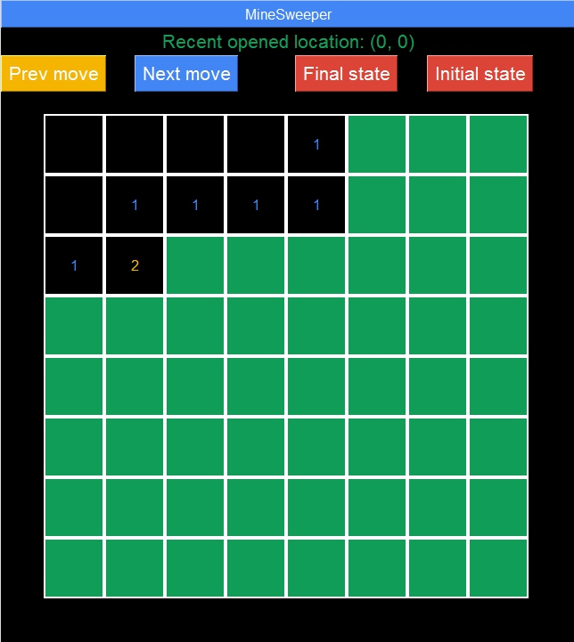
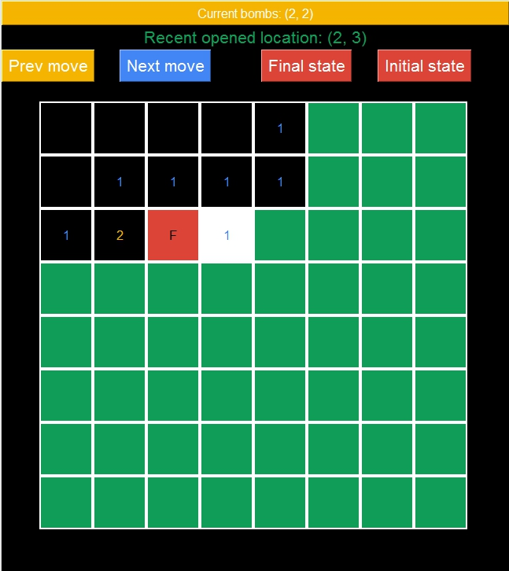
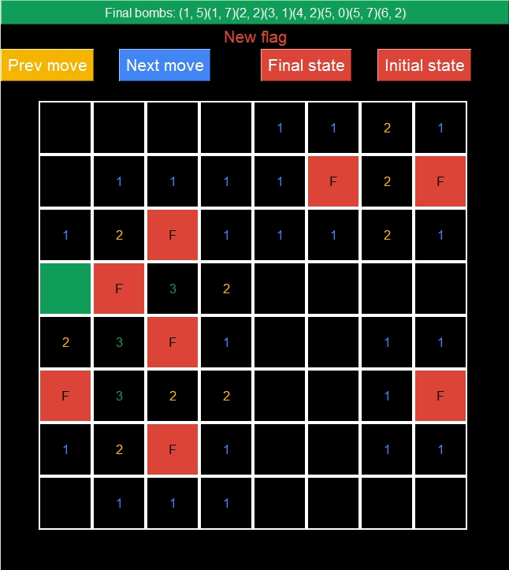

# Minesweeper Agent

Minesweeper solver agent with CLIPS and Python.

## Requirements

1. Python (3.7 or higher)
2. [CLIPS](https://sourceforge.net/projects/clipsrules/files/CLIPS/6.30/)
3. clipspy

Use the package manager [pip](https://pip.pypa.io/en/stable/) to install `clipspy`

```bash
pip install clipspy
```

## Usage
1. Clone this repository.
2. Open Command Prompt/Terminal.
3. Run the program.

a. Input from file

`python agent.py {filename}`

b. Input from Command Prompt

`python agent.py`

## Input
The input contains this following information, i.e. the board's size, the number of mines, and the locations of the mines.

### Example Input from file
see example at `/assets/tc` directory

### Example Input from Command Prompt
5 // board's size

2 // number of mines


2, 3 // location of mines

4, 4 // location of mines

## Screenshots

### Initial Button Clicked


### Next/Previous button Clicked


### Final Button Clicked
